# BDF Font Catalogue

A collection of 56 bitmap fonts in BDF format.

---

## 10x20

*-Misc-Fixed-Medium-R-Normal--20-200-75-75-C-100-ISO10646-1*

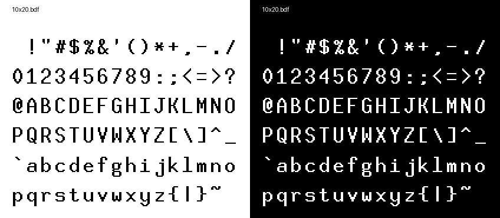

**Download:** [10x20.bdf](10x20.bdf)

| Property | Value |
|----------|-------|
| Filename | `10x20.bdf` |
| File Size | 951.8 KB |
| Characters | 5205 |
| Size | 20px / 20pt / 10x20 |
| Spacing | Monospace |
| Weight/Style | Medium |
| Copyright | Public domain font.  Share and enjoy. |
| Character Set | ISO10646-1 |

---

## 4x6

*-Misc-Fixed-Medium-R-Normal--6-60-75-75-C-40-ISO10646-1*

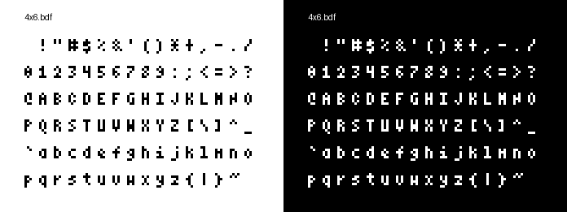

**Download:** [4x6.bdf](4x6.bdf)

| Property | Value |
|----------|-------|
| Filename | `4x6.bdf` |
| File Size | 92.1 KB |
| Characters | 919 |
| Size | 6px / 6pt / 4x6 |
| Spacing | Monospace |
| Weight/Style | Medium |
| Copyright | Public domain font.  Share and enjoy. |
| Character Set | ISO10646-1 |

---

## 5x7

*-Misc-Fixed-Medium-R-Normal--7-70-75-75-C-50-ISO10646-1*

**Download:** [5x7.bdf](5x7.bdf)

| Property | Value |
|----------|-------|
| Filename | `5x7.bdf` |
| File Size | 190.2 KB |
| Characters | 1848 |
| Size | 7px / 7pt / 5x7 |
| Spacing | Monospace |
| Weight/Style | Medium |
| Copyright | Public domain font.  Share and enjoy. |
| Character Set | ISO10646-1 |

---

## 5x8

*-Misc-Fixed-Medium-R-Normal--8-80-75-75-C-50-ISO10646-1*

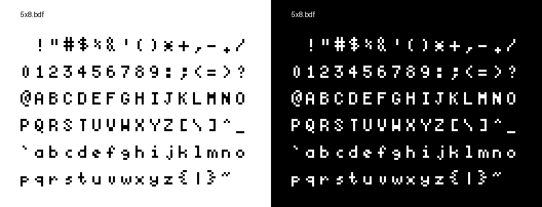

**Download:** [5x8.bdf](5x8.bdf)

| Property | Value |
|----------|-------|
| Filename | `5x8.bdf` |
| File Size | 151.3 KB |
| Characters | 1426 |
| Size | 8px / 11pt / 5x8 |
| Spacing | Monospace |
| Weight/Style | Medium |
| Copyright | Public domain font.  Share and enjoy. |
| Character Set | ISO10646-1 |

---

## 6x10

*-Misc-Fixed-Medium-R-Normal--10-100-75-75-C-60-ISO10646-1*

**Download:** [6x10.bdf](6x10.bdf)

| Property | Value |
|----------|-------|
| Filename | `6x10.bdf` |
| File Size | 206.1 KB |
| Characters | 1824 |
| Size | 10px / 10pt / 6x10 |
| Spacing | Monospace |
| Weight/Style | Medium |
| Copyright | Public domain terminal emulator font.  Share and enjoy. |
| Character Set | ISO10646-1 |

---

## 6x12

*-Misc-Fixed-Medium-R-SemiCondensed--12-110-75-75-C-60-ISO10646-1*

**Download:** [6x12.bdf](6x12.bdf)

| Property | Value |
|----------|-------|
| Filename | `6x12.bdf` |
| File Size | 536.8 KB |
| Characters | 4531 |
| Size | 12px / 12pt / 6x12 |
| Spacing | Monospace |
| Weight/Style | Medium |
| Copyright | Public domain terminal emulator font.  Share and enjoy. |
| Character Set | ISO10646-1 |

---

## 6x13

*-Misc-Fixed-Medium-R-SemiCondensed--13-120-75-75-C-60-ISO10646-1*

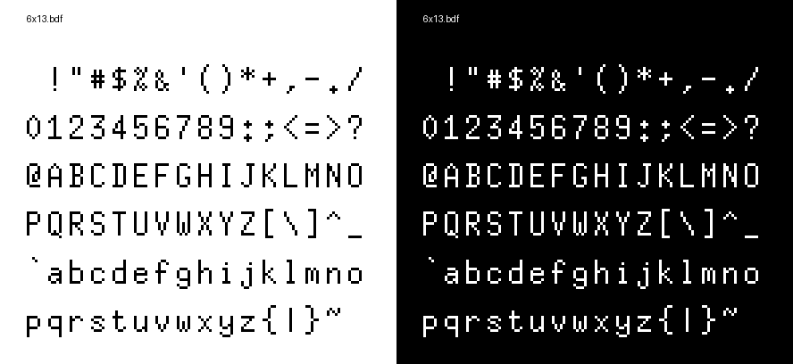

**Download:** [6x13.bdf](6x13.bdf)

| Property | Value |
|----------|-------|
| Filename | `6x13.bdf` |
| File Size | 500.1 KB |
| Characters | 4121 |
| Size | 13px / 12pt / 6x13 |
| Spacing | Monospace |
| Weight/Style | Medium |
| Copyright | Public domain font.  Share and enjoy. |
| Character Set | ISO10646-1 |

---

## 6x13B

*-Misc-Fixed-Bold-R-SemiCondensed--13-120-75-75-C-60-ISO10646-1*

**Download:** [6x13B.bdf](6x13B.bdf)

| Property | Value |
|----------|-------|
| Filename | `6x13B.bdf` |
| File Size | 155.7 KB |
| Characters | 1282 |
| Size | 13px / 13pt / 6x13 |
| Spacing | Monospace |
| Weight/Style | Bold |
| Copyright | Public domain font.  Share and enjoy. |
| Character Set | ISO10646-1 |

---

## 6x13O

*-Misc-Fixed-Medium-O-SemiCondensed--13-120-75-75-C-60-ISO10646-1*

**Download:** [6x13O.bdf](6x13O.bdf)

| Property | Value |
|----------|-------|
| Filename | `6x13O.bdf` |
| File Size | 93.6 KB |
| Characters | 770 |
| Size | 13px / 12pt / 6x13 |
| Spacing | Monospace |
| Weight/Style | Medium Oblique |
| Copyright | Public domain font.  Share and enjoy. |
| Character Set | ISO10646-1 |

---

## 6x9

*-Misc-Fixed-Medium-R-Normal--9-90-75-75-C-60-ISO10646-1*

**Download:** [6x9.bdf](6x9.bdf)

| Property | Value |
|----------|-------|
| Filename | `6x9.bdf` |
| File Size | 141.4 KB |
| Characters | 1296 |
| Size | 9px / 9pt / 6x9 |
| Spacing | Monospace |
| Weight/Style | Medium |
| Copyright | Public domain font.  Share and enjoy. |
| Character Set | ISO10646-1 |

---

## 7x13

*-Misc-Fixed-Medium-R-Normal--13-120-75-75-C-70-ISO10646-1*

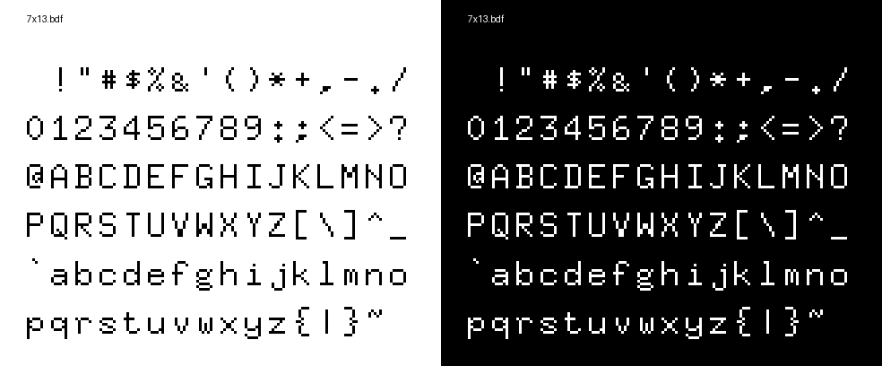

**Download:** [7x13.bdf](7x13.bdf)

| Property | Value |
|----------|-------|
| Filename | `7x13.bdf` |
| File Size | 391.4 KB |
| Characters | 3226 |
| Size | 13px / 13pt / 7x13 |
| Spacing | Monospace |
| Weight/Style | Medium |
| Copyright | Public domain font.  Share and enjoy. |
| Character Set | ISO10646-1 |

---

## 7x13B

*-Misc-Fixed-Bold-R-Normal--13-120-75-75-C-70-ISO10646-1*

**Download:** [7x13B.bdf](7x13B.bdf)

| Property | Value |
|----------|-------|
| Filename | `7x13B.bdf` |
| File Size | 121.8 KB |
| Characters | 1003 |
| Size | 13px / 13pt / 7x13 |
| Spacing | Monospace |
| Weight/Style | Bold |
| Copyright | Public domain font.  Share and enjoy. |
| Character Set | ISO10646-1 |

---

## 7x13O

*-Misc-Fixed-Medium-O-Normal--13-120-75-75-C-70-ISO10646-1*

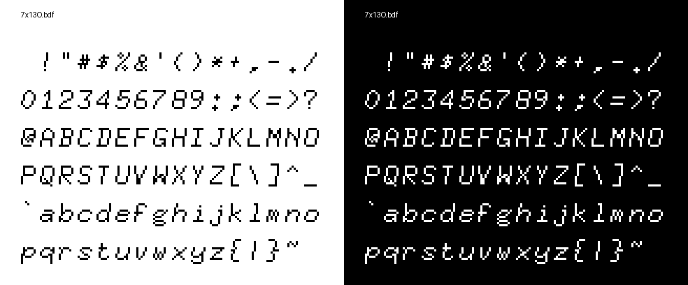

**Download:** [7x13O.bdf](7x13O.bdf)

| Property | Value |
|----------|-------|
| Filename | `7x13O.bdf` |
| File Size | 101.0 KB |
| Characters | 831 |
| Size | 13px / 13pt / 7x13 |
| Spacing | Monospace |
| Weight/Style | Medium Oblique |
| Copyright | Public domain font.  Share and enjoy. |
| Character Set | ISO10646-1 |

---

## 7x14

*-Misc-Fixed-Medium-R-Normal--14-130-75-75-C-70-ISO10646-1*

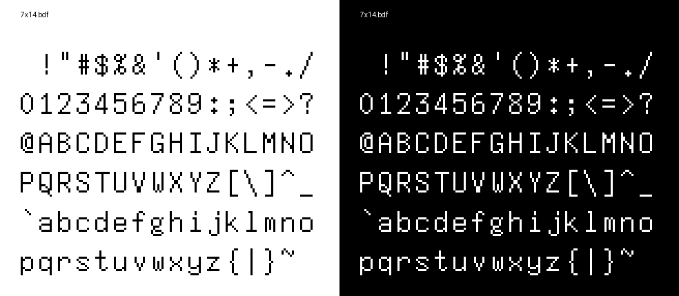

**Download:** [7x14.bdf](7x14.bdf)

| Property | Value |
|----------|-------|
| Filename | `7x14.bdf` |
| File Size | 320.2 KB |
| Characters | 2576 |
| Size | 14px / 7pt / 7x14 |
| Spacing | Monospace |
| Weight/Style | Medium |
| Copyright | Public domain font.  Share and enjoy. |
| Character Set | ISO10646-1 |

---

## 7x14B

*-Misc-Fixed-Bold-R-Normal--14-130-75-75-C-70-ISO10646-1*

**Download:** [7x14B.bdf](7x14B.bdf)

| Property | Value |
|----------|-------|
| Filename | `7x14B.bdf` |
| File Size | 125.5 KB |
| Characters | 1009 |
| Size | 14px / 7pt / 7x14 |
| Spacing | Monospace |
| Weight/Style | Bold |
| Copyright | Public domain font.  Share and enjoy. |
| Character Set | ISO10646-1 |

---

## 8x13

*-Misc-Fixed-Medium-R-Normal--13-120-75-75-C-80-ISO10646-1*

**Download:** [8x13.bdf](8x13.bdf)

| Property | Value |
|----------|-------|
| Filename | `8x13.bdf` |
| File Size | 449.2 KB |
| Characters | 3703 |
| Size | 13px / 13pt / 8x13 |
| Spacing | Monospace |
| Weight/Style | Medium |
| Copyright | Public domain font.  Share and enjoy. |
| Character Set | ISO10646-1 |

---

## 8x13B

*-Misc-Fixed-Bold-R-Normal--13-120-75-75-C-80-ISO10646-1*

**Download:** [8x13B.bdf](8x13B.bdf)

| Property | Value |
|----------|-------|
| Filename | `8x13B.bdf` |
| File Size | 138.4 KB |
| Characters | 1141 |
| Size | 13px / 13pt / 8x13 |
| Spacing | Monospace |
| Weight/Style | Bold |
| Copyright | Public domain font.  Share and enjoy. |
| Character Set | ISO10646-1 |

---

## 8x13O

*-Misc-Fixed-Medium-O-Normal--13-120-75-75-C-80-ISO10646-1*

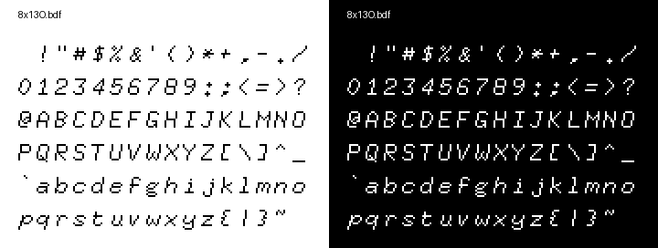

**Download:** [8x13O.bdf](8x13O.bdf)

| Property | Value |
|----------|-------|
| Filename | `8x13O.bdf` |
| File Size | 156.8 KB |
| Characters | 1295 |
| Size | 13px / 13pt / 8x13 |
| Spacing | Monospace |
| Weight/Style | Medium Oblique |
| Copyright | Public domain font.  Share and enjoy. |
| Character Set | ISO10646-1 |

---

## 9x15

*-Misc-Fixed-Medium-R-Normal--15-140-75-75-C-90-ISO10646-1*

**Download:** [9x15.bdf](9x15.bdf)

| Property | Value |
|----------|-------|
| Filename | `9x15.bdf` |
| File Size | 747.7 KB |
| Characters | 4777 |
| Size | 15px / 15pt / 9x15 |
| Spacing | Monospace |
| Weight/Style | Medium |
| Copyright | Public domain font.  Share and enjoy. |
| Character Set | ISO10646-1 |

---

## 9x15B

*-Misc-Fixed-Bold-R-Normal--15-140-75-75-C-90-ISO10646-1*

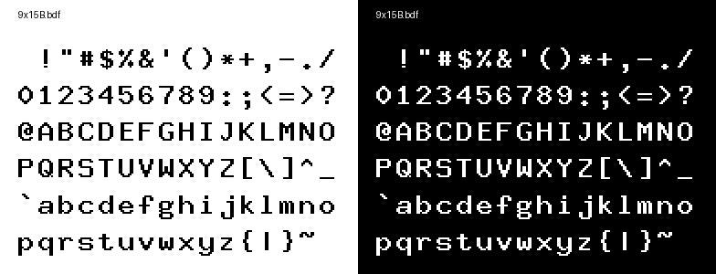

**Download:** [9x15B.bdf](9x15B.bdf)

| Property | Value |
|----------|-------|
| Filename | `9x15B.bdf` |
| File Size | 264.3 KB |
| Characters | 1688 |
| Size | 15px / 11pt / 9x15 |
| Spacing | Monospace |
| Weight/Style | Bold |
| Copyright | Public domain font.  Share and enjoy. |
| Character Set | ISO10646-1 |

---

## 9x18

*-Misc-Fixed-Medium-R-Normal--18-120-100-100-C-90-ISO10646-1*

**Download:** [9x18.bdf](9x18.bdf)

| Property | Value |
|----------|-------|
| Filename | `9x18.bdf` |
| File Size | 815.4 KB |
| Characters | 4766 |
| Size | 18px / 12pt / 9x18 |
| Spacing | Monospace |
| Weight/Style | Medium |
| Copyright | Public domain font.  Share and enjoy. |
| Character Set | ISO10646-1 |

---

## 9x18B

*-Misc-Fixed-Bold-R-Normal--18-120-100-100-C-90-ISO10646-1*

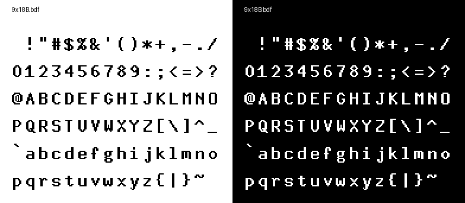

**Download:** [9x18B.bdf](9x18B.bdf)

| Property | Value |
|----------|-------|
| Filename | `9x18B.bdf` |
| File Size | 130.6 KB |
| Characters | 762 |
| Size | 18px / 12pt / 9x18 |
| Spacing | Monospace |
| Weight/Style | Bold |
| Copyright | Public domain font.  Share and enjoy. |
| Character Set | ISO10646-1 |

---

## clR6x12

*-Schumacher-Clean-Medium-R-Normal--12-120-75-75-C-60-ISO10646-1*

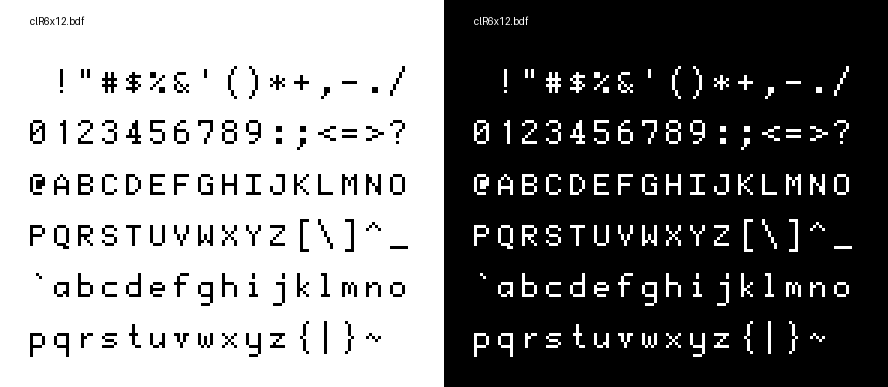

**Download:** [clR6x12.bdf](clR6x12.bdf)

| Property | Value |
|----------|-------|
| Filename | `clR6x12.bdf` |
| File Size | 142.5 KB |
| Characters | 1194 |
| Size | 12px / 12pt / 6x12 |
| Spacing | Monospace |
| Weight/Style | Medium |
| Copyright | Copyright 1989 Dale Schumacher, 1999 Robert Brady. |
| Character Set | ISO10646-1 |

---

## cozette

*-slavfox-Cozette-Medium-R-Normal--13-120-75-75-M-60-ISO10646-1*

**Download:** [cozette.bdf](cozette.bdf)

| Property | Value |
|----------|-------|
| Filename | `cozette.bdf` |
| File Size | 657.7 KB |
| Characters | 5983 |
| Size | 13px / 12pt / 14x15 |
| Spacing | Monospace |
| Weight/Style | Medium |
| Copyright | (c) 2020-2025 Slavfox |
| Character Set | ISO10646-1 |

---

## creep

*-gbdfed-creep-Regular-R-Normal--16-120-96-96-M-4-ISO10646-1*

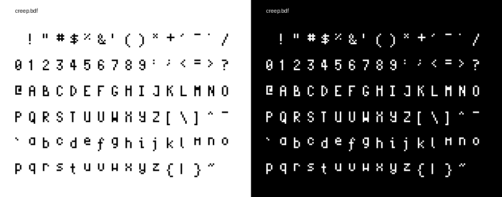

**Download:** [creep.bdf](creep.bdf)

| Property | Value |
|----------|-------|
| Filename | `creep.bdf` |
| File Size | 83.5 KB |
| Characters | 830 |
| Size | 16px / 12pt / 7x12 |
| Spacing | Monospace |
| Weight/Style | Medium |
| Copyright | Copyright romeovs 2013 |
| Character Set | ISO10646-1 |

---

## HaxorMedium-10

*-ucw.cz-Haxor-Medium-R-Normal--12-120-72-72-C-72-iso8859-2*

**Download:** [HaxorMedium-10.bdf](HaxorMedium-10.bdf)

| Property | Value |
|----------|-------|
| Filename | `HaxorMedium-10.bdf` |
| File Size | 22.8 KB |
| Characters | 199 |
| Size | 11px / 11pt / 6x11 |
| Spacing | Monospace |
| Weight/Style | Medium |
| Character Set | iso8859-2 |

---

## HaxorMedium-11

*-ucw.cz-Haxor-Medium-R-Normal--12-120-72-72-C-72-iso8859-2*

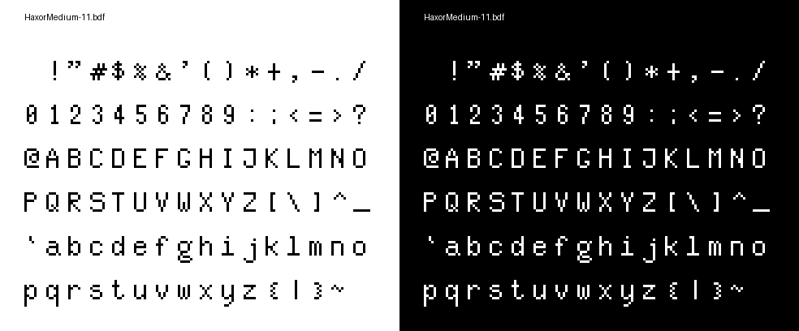

**Download:** [HaxorMedium-11.bdf](HaxorMedium-11.bdf)

| Property | Value |
|----------|-------|
| Filename | `HaxorMedium-11.bdf` |
| File Size | 24.0 KB |
| Characters | 199 |
| Size | 12px / 11pt / 7x13 |
| Spacing | Monospace |
| Weight/Style | Medium |
| Character Set | iso8859-2 |

---

## HaxorMedium-12

*-ucw.cz-Haxor-Medium-R-Normal--12-120-72-72-C-72-iso8859-2*

**Download:** [HaxorMedium-12.bdf](HaxorMedium-12.bdf)

| Property | Value |
|----------|-------|
| Filename | `HaxorMedium-12.bdf` |
| File Size | 24.6 KB |
| Characters | 199 |
| Size | 12px / 12pt / 8x14 |
| Spacing | Monospace |
| Weight/Style | Medium |
| Character Set | iso8859-2 |

---

## HaxorMedium-13

*-ucw.cz-Haxor-Medium-R-Normal--13-120-72-72-C-72-iso8859-2*

**Download:** [HaxorMedium-13.bdf](HaxorMedium-13.bdf)

| Property | Value |
|----------|-------|
| Filename | `HaxorMedium-13.bdf` |
| File Size | 30.9 KB |
| Characters | 199 |
| Size | 12px / 13pt / 9x15 |
| Spacing | Monospace |
| Weight/Style | Medium |
| Character Set | iso8859-2 |

---

## HaxorNarrow-15

*-ucw.cz-Haxor-Narrow-R-Normal--15-120-72-72-M-72-iso8859-2*

**Download:** [HaxorNarrow-15.bdf](HaxorNarrow-15.bdf)

| Property | Value |
|----------|-------|
| Filename | `HaxorNarrow-15.bdf` |
| File Size | 22.2 KB |
| Characters | 199 |
| Size | 15pt / 8x17 |
| Spacing | Monospace |
| Weight/Style | Normal |
| Character Set | iso8859-2 |

---

## HaxorNarrow-16

*-ucw.cz-Haxor-Narrow-R-Normal--16-120-72-72-M-72-iso8859-2*

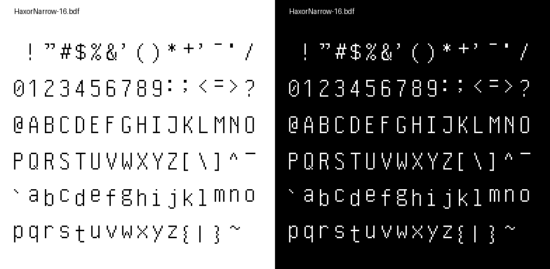

**Download:** [HaxorNarrow-16.bdf](HaxorNarrow-16.bdf)

| Property | Value |
|----------|-------|
| Filename | `HaxorNarrow-16.bdf` |
| File Size | 23.0 KB |
| Characters | 199 |
| Size | 16px / 13pt / 9x21 |
| Spacing | Monospace |
| Weight/Style | Normal |
| Character Set | iso8859-2 |

---

## HaxorNarrow-17

*-ucw.cz-Haxor-Narrow-R-Normal--18-120-72-72-M-72-iso8859-2*

**Download:** [HaxorNarrow-17.bdf](HaxorNarrow-17.bdf)

| Property | Value |
|----------|-------|
| Filename | `HaxorNarrow-17.bdf` |
| File Size | 23.5 KB |
| Characters | 199 |
| Size | 18px / 13pt / 9x21 |
| Spacing | Monospace |
| Weight/Style | Normal |
| Character Set | iso8859-2 |

---

## helvR12 copy

*-Adobe-Helvetica-Medium-R-Normal--12-120-75-75-P-67-ISO10646-1*

**Download:** [helvR12 copy.bdf](helvR12 copy.bdf)

| Property | Value |
|----------|-------|
| Filename | `helvR12 copy.bdf` |
| File Size | 229.1 KB |
| Characters | 2000 |
| Size | 12px / 12pt / 14x15 |
| Spacing | Proportional |
| Weight/Style | Medium |
| Copyright | Copyright (c) 1984, 1987 Adobe Systems Incorporated. All Rights Reserved. Copyright (c) 1988, 1991 Digital Equipment Corporation. All Rights Reserved. |
| Character Set | ISO10646-1 |

---

## helvR12

*-Adobe-Helvetica-Medium-R-Normal--12-120-75-75-P-67-ISO10646-1*

**Download:** [helvR12.bdf](helvR12.bdf)

| Property | Value |
|----------|-------|
| Filename | `helvR12.bdf` |
| File Size | 229.1 KB |
| Characters | 2000 |
| Size | 12px / 12pt / 14x15 |
| Spacing | Proportional |
| Weight/Style | Medium |
| Copyright | Copyright (c) 1984, 1987 Adobe Systems Incorporated. All Rights Reserved. Copyright (c) 1988, 1991 Digital Equipment Corporation. All Rights Reserved. |
| Character Set | ISO10646-1 |

---

## knxt

*-k-knxt-Medium-R-Normal--20-200-72-72-C-100-ISO10646-1*

**Download:** [knxt.bdf](knxt.bdf)

| Property | Value |
|----------|-------|
| Filename | `knxt.bdf` |
| File Size | 492.4 KB |
| Characters | 2743 |
| Size | 20px / 20pt / 9x20 |
| Spacing | Monospace |
| Weight/Style | Medium |
| Copyright | Konstantin Bytensky |
| Character Set | ISO10646-1 |

---

## logisoso46

*-FreeType-Logisoso-Medium-R-Normal--66-660-72-72-P-77-ISO10646-1*

**Download:** [logisoso46.bdf](logisoso46.bdf)

| Property | Value |
|----------|-------|
| Filename | `logisoso46.bdf` |
| File Size | 92.1 KB |
| Characters | 527 |
| Size | 66px / 66pt / 178x68 |
| Spacing | Proportional |
| Weight/Style | Medium |
| Copyright | Created by Mathieu Gabiot with FontForge 2.0 (http://fontforge.sf.net) - Brussels - 2009 |
| Character Set | ISO10646-1 |

---

## peep-10x20

*-zevv-peep-Medium-R-Normal--20-175-75-75-C-100-ISO8859-15*

**Download:** [peep-10x20.bdf](peep-10x20.bdf)

| Property | Value |
|----------|-------|
| Filename | `peep-10x20.bdf` |
| File Size | 39.9 KB |
| Characters | 192 |
| Size | 20px / 20pt / 10x20 |
| Spacing | Monospace |
| Weight/Style | Medium |
| Copyright | Zevv |
| Character Set | ISO8859-15 |

---

## PsevdoAzbukaMedium-12

*-ucw.cz-PsevdoAzbuka-Medium-R-Normal--12-120-72-72-C-72-iso8859-2*

**Download:** [PsevdoAzbukaMedium-12.bdf](PsevdoAzbukaMedium-12.bdf)

| Property | Value |
|----------|-------|
| Filename | `PsevdoAzbukaMedium-12.bdf` |
| File Size | 24.5 KB |
| Characters | 199 |
| Size | 12px / 12pt / 8x14 |
| Spacing | Monospace |
| Weight/Style | Medium |
| Character Set | iso8859-2 |

---

## scientifica-11

*-nerdypepper-scientifica-medium-r-normal--11-80-100-100-C-50-ISO10646-1*

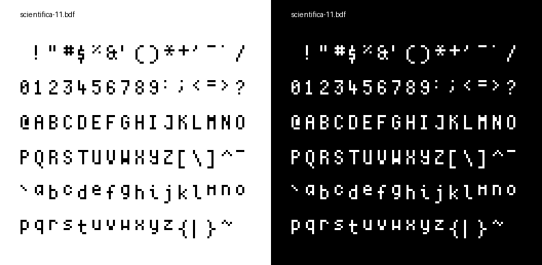

**Download:** [scientifica-11.bdf](scientifica-11.bdf)

| Property | Value |
|----------|-------|
| Filename | `scientifica-11.bdf` |
| File Size | 109.5 KB |
| Characters | 1070 |
| Size | 11px / 11pt / 5x12 |
| Spacing | Monospace |
| Weight/Style | Medium |
| Copyright | Copyright (c) 2016, romeovs |
| Character Set | ISO10646-1 |

---

## scientificaBold-11

*-nerdypepper-scientifica-medium-r-normal--11-80-100-100-C-50-ISO10646-1*

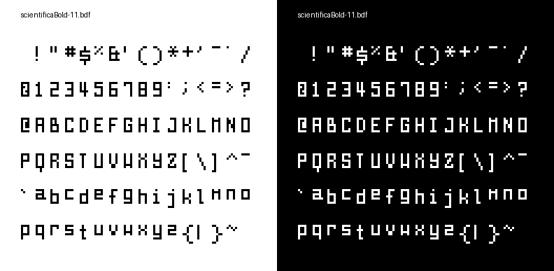

**Download:** [scientificaBold-11.bdf](scientificaBold-11.bdf)

| Property | Value |
|----------|-------|
| Filename | `scientificaBold-11.bdf` |
| File Size | 99.2 KB |
| Characters | 973 |
| Size | 11px / 11pt / 5x12 |
| Spacing | Monospace |
| Weight/Style | Bold |
| Copyright | Copyright (c) 2016, romeovs |
| Character Set | ISO10646-1 |

---

## scientificaItalic-11

*-nerdypepper-scientifica-medium-r-normal--11-80-100-100-C-50-ISO10646-1*

**Download:** [scientificaItalic-11.bdf](scientificaItalic-11.bdf)

| Property | Value |
|----------|-------|
| Filename | `scientificaItalic-11.bdf` |
| File Size | 109.5 KB |
| Characters | 1070 |
| Size | 11px / 11pt / 5x12 |
| Spacing | Monospace |
| Weight/Style | Medium Italic |
| Copyright | Copyright (c) 2016, romeovs |
| Character Set | ISO10646-1 |

---

## sinclair

*-Sinclair-ZXSpectrum-Medium-R-Normal--8-80-75-75-C-80-ISO8859-1*

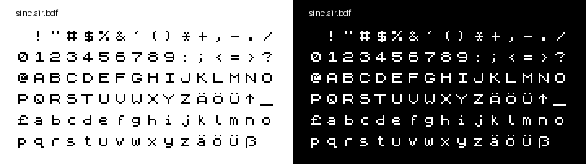

**Download:** [sinclair.bdf](sinclair.bdf)

| Property | Value |
|----------|-------|
| Filename | `sinclair.bdf` |
| File Size | 10.1 KB |
| Characters | 96 |
| Size | 8px / 8pt / 8x8 |
| Spacing | Monospace |
| Weight/Style | Medium |

---

## spleen-12x24

*-misc-spleen-medium-r-normal--24-240-72-72-C-120-iso10646-1*

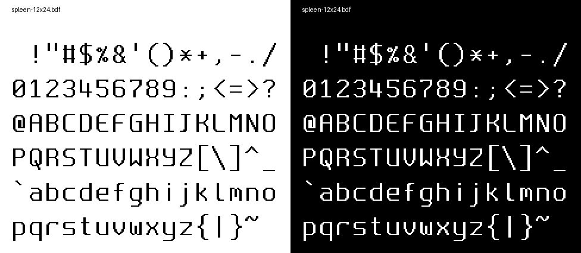

**Download:** [spleen-12x24.bdf](spleen-12x24.bdf)

| Property | Value |
|----------|-------|
| Filename | `spleen-12x24.bdf` |
| File Size | 42.2 KB |
| Characters | 192 |
| Size | 24px / 24pt / 12x24 |
| Spacing | Monospace |
| Weight/Style | Normal |
| Copyright | Copyright (c) 2018-2019, Frederic Cambus |
| Character Set | ISO10646-1 |

---

## spleen-16x32

*-misc-spleen-medium-r-normal--32-320-72-72-C-160-iso10646-1*

**Download:** [spleen-16x32.bdf](spleen-16x32.bdf)

| Property | Value |
|----------|-------|
| Filename | `spleen-16x32.bdf` |
| File Size | 49.7 KB |
| Characters | 192 |
| Size | 32px / 32pt / 16x32 |
| Spacing | Monospace |
| Weight/Style | Normal |
| Copyright | Copyright (c) 2018-2019, Frederic Cambus |
| Character Set | ISO10646-1 |

---

## spleen-32x64

*-misc-spleen-medium-r-normal--64-640-72-72-C-320-iso10646-1*

**Download:** [spleen-32x64.bdf](spleen-32x64.bdf)

| Property | Value |
|----------|-------|
| Filename | `spleen-32x64.bdf` |
| File Size | 127.9 KB |
| Characters | 192 |
| Size | 64px / 64pt / 32x64 |
| Spacing | Monospace |
| Weight/Style | Normal |
| Copyright | Copyright (c) 2018-2019, Frederic Cambus |
| Character Set | ISO10646-1 |

---

## spleen-5x8

*-misc-spleen-medium-r-normal--8-80-72-72-C-50-iso10646-1*

**Download:** [spleen-5x8.bdf](spleen-5x8.bdf)

| Property | Value |
|----------|-------|
| Filename | `spleen-5x8.bdf` |
| File Size | 23.6 KB |
| Characters | 192 |
| Size | 8px / 8pt / 5x8 |
| Spacing | Monospace |
| Weight/Style | Normal |
| Copyright | Copyright (c) 2018-2019, Frederic Cambus |
| Character Set | ISO10646-1 |

---

## spleen-8x16

*-misc-spleen-medium-r-normal--16-160-72-72-C-80-iso10646-1*

**Download:** [spleen-8x16.bdf](spleen-8x16.bdf)

| Property | Value |
|----------|-------|
| Filename | `spleen-8x16.bdf` |
| File Size | 28.3 KB |
| Characters | 192 |
| Size | 16px / 16pt / 8x16 |
| Spacing | Monospace |
| Weight/Style | Normal |
| Copyright | Copyright (c) 2018-2019, Frederic Cambus |
| Character Set | ISO10646-1 |

---

## tahoma-10

*-FontForge-Tahoma-Book-R-Normal--10-100-75-75-P-57-ISO10646-1*

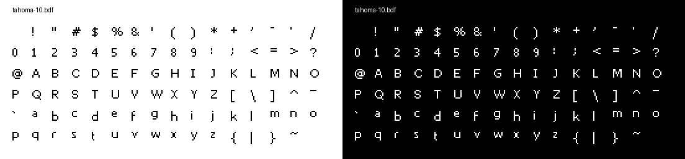

**Download:** [tahoma-10.bdf](tahoma-10.bdf)

| Property | Value |
|----------|-------|
| Filename | `tahoma-10.bdf` |
| File Size | 47.1 KB |
| Characters | 450 |
| Size | 10px / 10pt / 14x12 |
| Spacing | Proportional |
| Weight/Style | Normal |
| Copyright | Copyright (c) 2004 Larry Snyder, Based on Bitstream Vera Sans Copyright (c) 2003 by Bitstream, Inc. Font renamed in accordance with former's license. Please do not contact Bitstream Inc. for any reason regarding this font. |
| Character Set | ISO10646-1 |

---

## tahoma-11

*-FontForge-Tahoma-Normal-R-Normal--11-80-96-96-P-62-ISO10646-1*

**Download:** [tahoma-11.bdf](tahoma-11.bdf)

| Property | Value |
|----------|-------|
| Filename | `tahoma-11.bdf` |
| File Size | 47.9 KB |
| Characters | 448 |
| Size | 11px / 8pt / 16x14 |
| Spacing | Proportional |
| Weight/Style | Medium |
| Character Set | ISO10646-1 |

---

## tahoma-12

*-FontForge-Tahoma-Normal-R-Normal--12-90-96-96-P-70-ISO10646-1*

**Download:** [tahoma-12.bdf](tahoma-12.bdf)

| Property | Value |
|----------|-------|
| Filename | `tahoma-12.bdf` |
| File Size | 38.2 KB |
| Characters | 348 |
| Size | 12px / 9pt / 17x15 |
| Spacing | Proportional |
| Weight/Style | Medium |
| Character Set | ISO10646-1 |

---

## tahoma-13

*-FontForge-Tahoma-Normal-R-Normal--13-100-96-96-P-73-ISO10646-1*

**Download:** [tahoma-13.bdf](tahoma-13.bdf)

| Property | Value |
|----------|-------|
| Filename | `tahoma-13.bdf` |
| File Size | 38.5 KB |
| Characters | 348 |
| Size | 13px / 10pt / 17x16 |
| Spacing | Proportional |
| Weight/Style | Medium |
| Character Set | ISO10646-1 |

---

## tahoma-15

*-FontForge-Tahoma-Normal-R-Normal--15-110-96-96-P-85-ISO10646-1*

**Download:** [tahoma-15.bdf](tahoma-15.bdf)

| Property | Value |
|----------|-------|
| Filename | `tahoma-15.bdf` |
| File Size | 41.7 KB |
| Characters | 348 |
| Size | 15px / 11pt / 21x18 |
| Spacing | Proportional |
| Weight/Style | Medium |
| Character Set | ISO10646-1 |

---

## tahoma-16

*-FontForge-Tahoma-Normal-R-Normal--16-120-96-96-P-93-ISO10646-1*

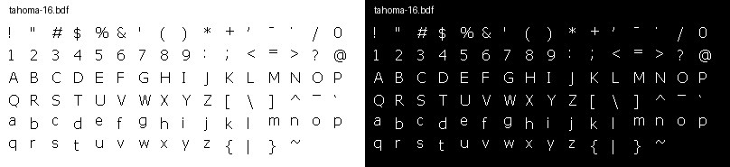

**Download:** [tahoma-16.bdf](tahoma-16.bdf)

| Property | Value |
|----------|-------|
| Filename | `tahoma-16.bdf` |
| File Size | 43.5 KB |
| Characters | 348 |
| Size | 16px / 12pt / 22x20 |
| Spacing | Proportional |
| Weight/Style | Medium |
| Character Set | ISO10646-1 |

---

## tahoma-8

*-FontForge-Tahoma-Book-R-Normal--8-80-75-75-P-43-ISO10646-1*

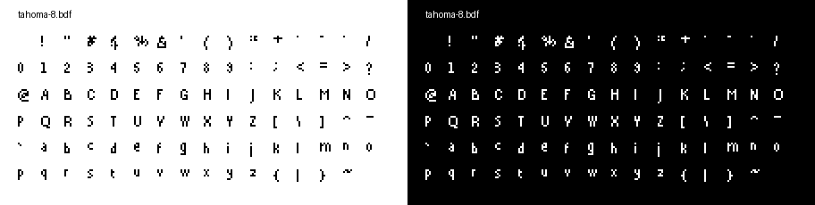

**Download:** [tahoma-8.bdf](tahoma-8.bdf)

| Property | Value |
|----------|-------|
| Filename | `tahoma-8.bdf` |
| File Size | 45.5 KB |
| Characters | 450 |
| Size | 8px / 8pt / 11x10 |
| Spacing | Proportional |
| Weight/Style | Normal |
| Copyright | Copyright (c) 2004 Larry Snyder, Based on Bitstream Vera Sans Copyright (c) 2003 by Bitstream, Inc. Font renamed in accordance with former's license. Please do not contact Bitstream Inc. for any reason regarding this font. |
| Character Set | ISO10646-1 |

---

## tahoma-9

*-FontForge-Tahoma-Book-R-Normal--9-90-75-75-P-54-ISO10646-1*

**Download:** [tahoma-9.bdf](tahoma-9.bdf)

| Property | Value |
|----------|-------|
| Filename | `tahoma-9.bdf` |
| File Size | 46.5 KB |
| Characters | 450 |
| Size | 9px / 9pt / 13x11 |
| Spacing | Proportional |
| Weight/Style | Normal |
| Copyright | Copyright (c) 2004 Larry Snyder, Based on Bitstream Vera Sans Copyright (c) 2003 by Bitstream, Inc. Font renamed in accordance with former's license. Please do not contact Bitstream Inc. for any reason regarding this font. |
| Character Set | ISO10646-1 |

---

## tom-thumb

*-Raccoon-Fixed4x6-Medium-R-Normal--6-60-75-75-P-40-ISO10646-1*

**Download:** [tom-thumb.bdf](tom-thumb.bdf)

| Property | Value |
|----------|-------|
| Filename | `tom-thumb.bdf` |
| File Size | 19.5 KB |
| Characters | 203 |
| Size | 6px / 6pt / 3x6 |
| Spacing | Proportional |
| Weight/Style | Medium |
| Copyright | MIT |
| Character Set | ISO10646-1 |

---

*Generated on 2025-08-26 00:59:36*
